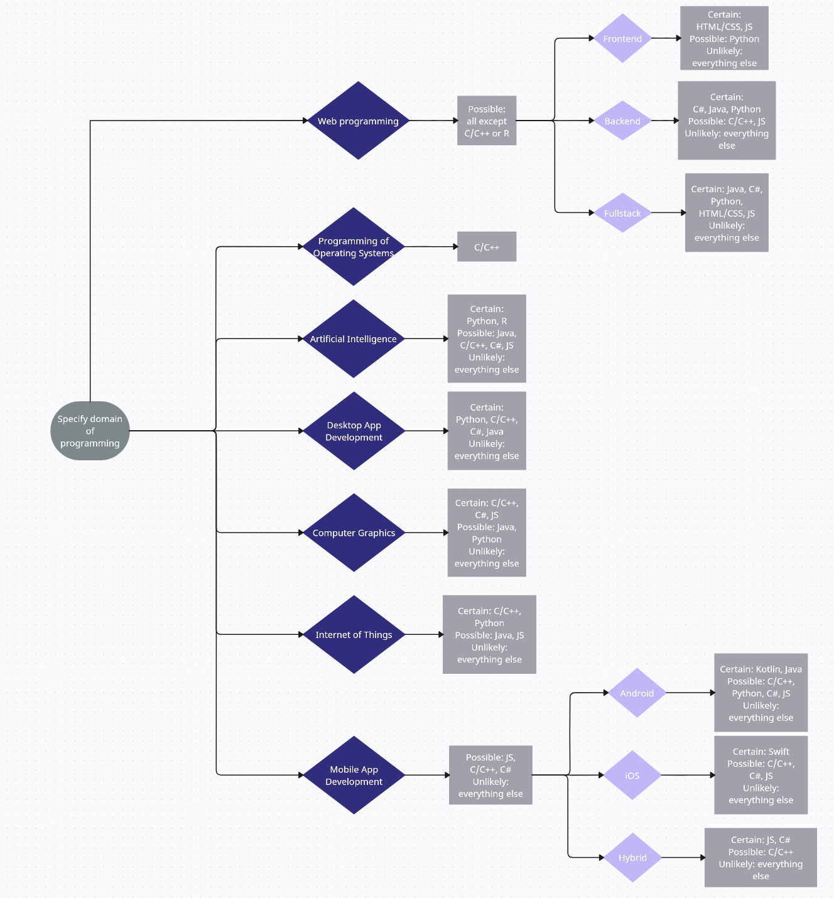

# Programming Language Expert System (PLES)

The PLES helps a user to choose a programming language based on the chosen domain of programming.

Here is its decision tree:

Images attributions:

- <a href="https://www.flaticon.com/free-icons/web-programming" title="web programming icons">Web programming icons created by Royyan Wijaya - Flaticon</a>
- <a href="https://www.flaticon.com/free-icons/coding" title="coding icons">Coding icons created by Freepik - Flaticon</a>
- <a href="https://www.flaticon.com/free-icons/c-sharp" title="c sharp icons">C sharp icons created by Freepik - Flaticon</a>
- <a href="https://www.flaticon.com/free-icons/java" title="java icons">Java icons created by Freepik - Flaticon</a>
- <a href="https://www.flaticon.com/free-icons/javascript" title="javascript icons">Javascript icons created by Freepik - Flaticon</a>
- <a href="https://www.flaticon.com/free-icons/python" title="python icons">Python icons created by Freepik - Flaticon</a>
- <a href="https://www.flaticon.com/free-icons/r" title="r icons">R icons created by Becris - Flaticon</a>
- <a href="https://www.flaticon.com/free-icons/swift" title="swift icons">Swift icons created by Freepik - Flaticon</a>
- <a href="https://www.flaticon.com/free-icons/html" title="html icons">Html icons created by Darius Dan - Flaticon</a>
